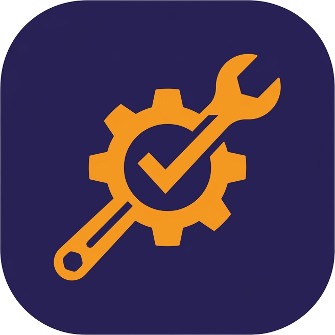
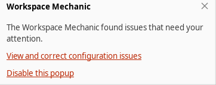
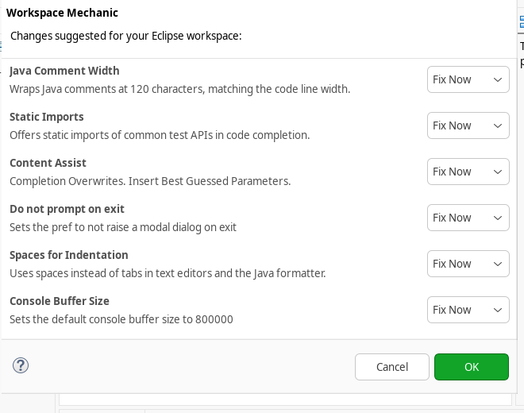
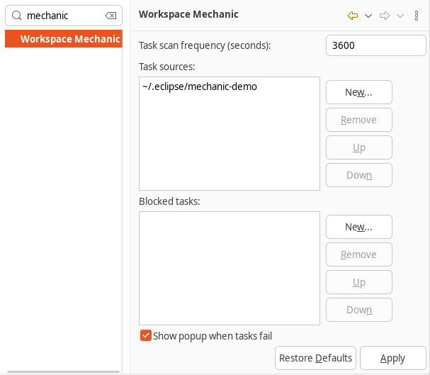

# Eclipse Workspace Mechanic

The Workspace Mechanic keeps an Eclipse installation and its workspaces in a defined state.
It periodically evaluates tasks (preference files, key binding files, Java tasks) and offers to repair the ones that fail.
This repository continues the original Google Code project.

## Screenshots

When tasks fail, a notification appears and the status bar shows a warning icon.

<picture>
  <source media="(prefers-color-scheme: dark)" srcset="docs/screenshots/notification-dark.png">
  
</picture>

The repair dialog lists the failing tasks and lets you fix them now, later or never.

<picture>
  <source media="(prefers-color-scheme: dark)" srcset="docs/screenshots/repair-dialog-dark.png">
  
</picture>

The preference page configures where tasks come from, how often they are checked and which tasks are blocked.

<picture>
  <source media="(prefers-color-scheme: dark)" srcset="docs/screenshots/preference-page-dark.png">
  
</picture>

## Installation

Add the update site below via *Help > Install New Software...* or install it from the [Eclipse Marketplace](https://marketplace.eclipse.org/content/workspace-mechanic).

https://alfsch.github.io/eclipse-updates/workspacemechanic

## Build

Requirements: Java 25 and Maven 3.9.9 or newer.

```bash
mvn clean verify
```

This builds the plug-ins, the feature and the p2 update site (`releng/update/target/repository`) and runs the tests.

The build uses [Tycho](https://github.com/eclipse-tycho/tycho) in pomless mode: the root `pom.xml` is the only POM, and the modules are derived from their `MANIFEST.MF`, `feature.xml`, `category.xml` and `.target` files.
`.mvn/maven.config` sets the Tycho version and builds with four parallel threads.

Dependencies come from the target platform `releng/target-platform/target-platform.target`, which you can also open in the Eclipse IDE and set as the active target platform.

### Tests

The tests use JUnit 5 and run inside an OSGi runtime with the workbench, so they need a display.
On a headless Linux machine, run the build under Xvfb:

```bash
xvfb-run -a mvn clean verify
```

To skip the tests, add `-DskipTests`.
To run a single test class:

```bash
mvn clean verify -pl :com.google.eclipse.mechanic.tests -am -Dtest=EpfFileModelTest -DfailIfNoTests=false
```

## License

Workspace Mechanic is licensed under the [Eclipse Public License 2.0](LICENSE) (SPDX: `EPL-2.0`).
